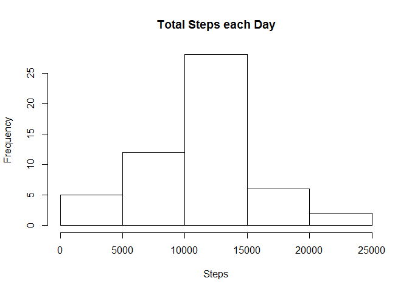
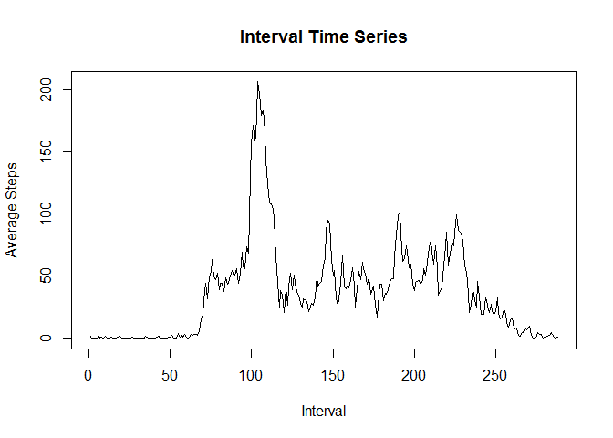
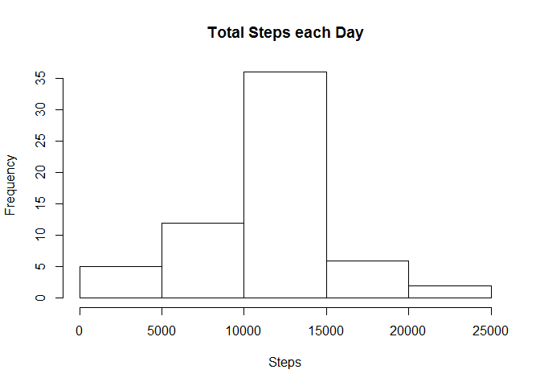
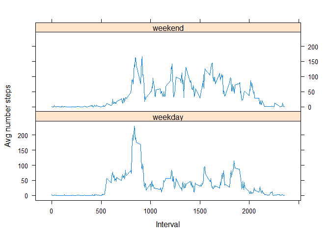

# Reproducible Research: Peer Assessment 1

The goal of this R Mardown file is to satisfy the requirements and answer the questions for the first Peer Assessment assignment of the John Hopkins Reproducible Research course on Coursera.  All of the needed scripts, data, and analysis information is provided here and published in this GitHub repository:  https://github.com/jvreal/RepData_PeerAssessment1

## Loading and preprocessing the data

The first step for this analysis is to read the activity data file, and format the date data appropriately.


```r
step_data <- read.csv("./activity.csv")

## Convert date to date type
step_data$date <- as.Date(step_data$date, format = "%Y-%m-%d")

head(step_data)
```

```
##   steps       date interval
## 1    NA 2012-10-01        0
## 2    NA 2012-10-01        5
## 3    NA 2012-10-01       10
## 4    NA 2012-10-01       15
## 5    NA 2012-10-01       20
## 6    NA 2012-10-01       25
```

Find complete cases:

```r
complete_step_data <- subset(step_data, complete.cases(step_data) == TRUE)

head(complete_step_data)
```

```
##     steps       date interval
## 289     0 2012-10-02        0
## 290     0 2012-10-02        5
## 291     0 2012-10-02       10
## 292     0 2012-10-02       15
## 293     0 2012-10-02       20
## 294     0 2012-10-02       25
```

## What is mean total number of steps taken per day?
Aggregate total steps per day, display hisogram, and provide mean and median values:


```r
daily_steps <- aggregate(complete_step_data$steps, by = list(complete_step_data$date), sum)
names(daily_steps)[1] = "date"
names(daily_steps)[2] = "steps"

head(daily_steps)
```

```
##         date steps
## 1 2012-10-02   126
## 2 2012-10-03 11352
## 3 2012-10-04 12116
## 4 2012-10-05 13294
## 5 2012-10-06 15420
## 6 2012-10-07 11015
```

Histogram for total steps taken each day:

```r
hist(daily_steps$steps, main="Total Steps each Day", xlab="Steps")
```

 

Mean and Median Total Steps each day:

```r
summary(daily_steps)
```

```
##       date                steps      
##  Min.   :2012-10-02   Min.   :   41  
##  1st Qu.:2012-10-16   1st Qu.: 8841  
##  Median :2012-10-29   Median :10765  
##  Mean   :2012-10-30   Mean   :10766  
##  3rd Qu.:2012-11-16   3rd Qu.:13294  
##  Max.   :2012-11-29   Max.   :21194
```


## What is the average daily activity pattern?

Provide a time series plot of 5 minute intervals accross all days

```r
## Split data by interval
interval_data <- split(complete_step_data, complete_step_data$interval, drop=TRUE)
interval_mean_data <- sapply(interval_data, function(x) mean(x$steps))
plot(interval_mean_data, type="l", main="Interval Time Series", ylab="Average Steps", xlab="Interval")
```

 

The 5 minute interval, on average across all days, that contains the maxium number of steps:

```r
head(interval_mean_data)
```

```
##         0         5        10        15        20        25 
## 1.7169811 0.3396226 0.1320755 0.1509434 0.0754717 2.0943396
```

```r
interval_mean_data[which.max(interval_mean_data)]
```

```
##      835 
## 206.1698
```

This shows interval 835 on average contains the most steps across all days and average number of steps in 206.


## Imputing missing values
How many intervals are there with no data?  In others words the number of rows with NA for steps?


```r
sum(is.na(step_data$steps))
```

```
## [1] 2304
```

Create a new data frame from original that replaces NAs with the mean for that interval across all other days.

```r
# Find interval means
mean_data <- aggregate(step_data$steps, by = list(step_data$interval), mean, na.rm=TRUE, na.action=NULL)
names(mean_data)[1] <- "interval"
names(mean_data)[2] <- "mean_steps"

# Replace NA data with mean for that interval
imputted_data <- merge(step_data, mean_data, by="interval", sort=FALSE)
imputted_data <- imputted_data[with(imputted_data, order(date, interval)),]
imputted_data$steps[is.na(imputted_data$steps)] <- round(imputted_data$mean_steps[is.na(imputted_data$steps)], digits=0)
imputted_data$mean_steps <- NULL ## Remove temporary colument with mean data
imputted_data <- imputted_data[, c(2,3,1)]  ## Fix column order

head(imputted_data)
```

```
##     steps       date interval
## 1       2 2012-10-01        0
## 63      0 2012-10-01        5
## 128     0 2012-10-01       10
## 205     0 2012-10-01       15
## 264     0 2012-10-01       20
## 327     2 2012-10-01       25
```

```r
head(step_data)
```

```
##   steps       date interval
## 1    NA 2012-10-01        0
## 2    NA 2012-10-01        5
## 3    NA 2012-10-01       10
## 4    NA 2012-10-01       15
## 5    NA 2012-10-01       20
## 6    NA 2012-10-01       25
```

Aggregate total steps per day, display hisogram, and provide mean and median values for new data set:


```r
daily_steps <- aggregate(imputted_data$steps, by = list(imputted_data$date), sum)
names(daily_steps)[1] = "date"
names(daily_steps)[2] = "steps"

head(daily_steps)
```

```
##         date steps
## 1 2012-10-01 10762
## 2 2012-10-02   126
## 3 2012-10-03 11352
## 4 2012-10-04 12116
## 5 2012-10-05 13294
## 6 2012-10-06 15420
```

Histogram for total steps taken each day:

```r
hist(daily_steps$steps, main="Total Steps each Day", xlab="Steps")
```

 

Mean and Median Total Steps each day:

```r
summary(daily_steps)
```

```
##       date                steps      
##  Min.   :2012-10-01   Min.   :   41  
##  1st Qu.:2012-10-16   1st Qu.: 9819  
##  Median :2012-10-31   Median :10762  
##  Mean   :2012-10-31   Mean   :10766  
##  3rd Qu.:2012-11-15   3rd Qu.:12811  
##  Max.   :2012-11-30   Max.   :21194
```

No impact to mean value using the rounded mean steps for 5 min interval in place of missing data.  Small impact to median value.

## Are there differences in activity patterns between weekdays and weekends?


```r
imputted_data$weekday <- weekdays(imputted_data$date)
imputted_data$weekday[which(imputted_data$weekday == "Monday")] <- "weekday"
imputted_data$weekday[which(imputted_data$weekday == "Tuesday")] <- "weekday"
imputted_data$weekday[which(imputted_data$weekday == "Wednesday")] <- "weekday"
imputted_data$weekday[which(imputted_data$weekday == "Thursday")] <- "weekday"
imputted_data$weekday[which(imputted_data$weekday == "Friday")] <- "weekday"
imputted_data$weekday[which(imputted_data$weekday == "Saturday")] <- "weekend"
imputted_data$weekday[which(imputted_data$weekday == "Sunday")] <- "weekend"
imputted_data$weekday <- as.factor(imputted_data$weekday)
head(imputted_data)
```

```
##     steps       date interval weekday
## 1       2 2012-10-01        0 weekday
## 63      0 2012-10-01        5 weekday
## 128     0 2012-10-01       10 weekday
## 205     0 2012-10-01       15 weekday
## 264     0 2012-10-01       20 weekday
## 327     2 2012-10-01       25 weekday
```

```r
levels(imputted_data$weekday)
```

```
## [1] "weekday" "weekend"
```

Make a time series plot of the 5 minute intervals vs average number of steps taken across all days for weekday and weekends.

```r
weekday_mean_data <- aggregate(imputted_data$steps, by = list(imputted_data$weekday, imputted_data$interval), mean)
names(weekday_mean_data)[1] <- "weekday"
names(weekday_mean_data)[2] <- "interval"
names(weekday_mean_data)[3] <- "mean_steps"

head(weekday_mean_data)
```

```
##   weekday interval mean_steps
## 1 weekday        0  2.2888889
## 2 weekend        0  0.2500000
## 3 weekday        5  0.4000000
## 4 weekend        5  0.0000000
## 5 weekday       10  0.1555556
## 6 weekend       10  0.0000000
```

Use lattice to create panel plot:

```r
library(lattice)
xyplot(weekday_mean_data$mean_steps ~ weekday_mean_data$interval | weekday_mean_data$weekday, layout=c(1,2), type="l", xlab="Interval", ylab="Avg number steps")
```

 


